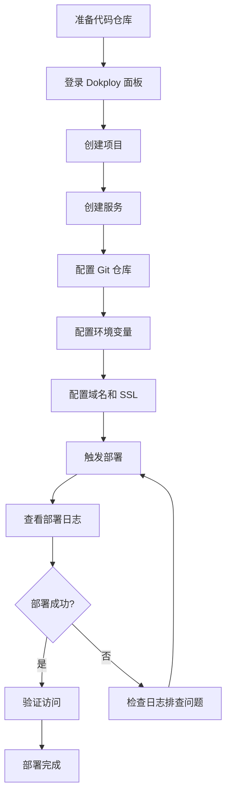

# Dokploy平台部署完整指南

> [!NOTE]
> **关于 Dokploy 部署方式**
> 
> Dokploy 是一个现代化的可视化 Docker 部署平台,所有部署操作都通过 Web 管理面板完成。
> 本指南将详细介绍如何使用 Dokploy 面板部署 TOGETHER 博客系统,**无需 SSH 连接服务器**。

## 目标

将TOGETHER博客系统部署到基于Dokploy的服务器平台,网站域名为`171780.xyz`,实现自动化博客系统和数据库支持。

---

## 📋 前期准备

### 1. 本地环境要求

- ✅ Node.js 16+ (用于构建)
- ✅ Git
- ✅ Docker (可选,用于本地测试)

### 2. Dokploy服务器要求

- ✅ Docker installed
- ✅ Docker Compose installed  
- ✅ Dokploy platform configured
- ✅ **Traefik proxy** running (Dokploy 自带)
- ✅ 域名已配置: `171780.xyz`

> [!IMPORTANT]
> ### Dokploy 网络配置
> Dokploy 平台自带 Traefik 反向代理,会自动管理容器网络和路由配置。
> **无需手动创建** `traefik-network`,Dokploy 会自动处理所有网络设置。

---

## 🎯 Dokploy 部署流程概览



## 🚀 快速开始

如果你已经熟悉 Dokploy,可以按照以下步骤快速部署:

1. **在 Dokploy 面板创建项目和服务**
2. **配置 Git 仓库**: `https://github.com/your-username/website-sample.git`
3. **设置环境变量**: `DOMAIN=171780.xyz`, `DB_PASSWORD=<安全密码>` 等
4. **配置域名**: `171780.xyz` 并启用 Let's Encrypt SSL
5. **点击部署**,等待完成

详细步骤请继续阅读下文。

> [!NOTE]
> **关于 GitHub 和 Vercel**
> 
> 如果你的 GitHub 仓库关联了 Vercel,推送代码时会触发 Vercel 自动构建。
> 本项目已配置 `vercel.json` 支持 Vercel 部署,无需额外设置。
> 
> 如果只使用 Dokploy 部署,可以在 Vercel 面板中断开 GitHub 连接。

---

## 🚀 部署步骤

### 步骤1: 本地构建

```bash
# 1. Clone项目
git clone <repository-url>
cd website-sample

# 2. 安装依赖(如果需要)
# npm install  # 仅构建工具依赖,可选

# 3. 在posts/目录添加Markdown文章(或使用现有示例)
# 示例文章已在 posts/ 目录

# 4. 运行完整构建
node tools/md-to-json-incremental.js
node tools/generate-article-pages.js
node tools/generate-sitemap.js

# 或使用一键构建命令(需要npm)
# npm run build
```

### 步骤2: 配置环境变量

```bash
# 复制环境变量示例文件
cp .env.example .env

# 编辑 .env 文件
nano .env
```

配置内容:
```env
# 主域名(用于sitemap和meta标签)
DOMAIN=171780.xyz

# 数据库配置
DB_NAME=together
DB_USER=together_user
DB_PASSWORD=YOUR_SECURE_PASSWORD  # 请修改为安全密码

# 可选:完整网站URL(如果设置了SITE_URL,将优先使用)
# SITE_URL=https://171780.xyz

API_URL=https://api.171780.xyz/api
NODE_ENV=production
```

> [!TIP]
> **环境变量优先级**:
> - 如果设置了`SITE_URL`,将直接使用它作为完整URL
> - 否则使用`DOMAIN`,自动添加`https://`前缀
> - 都未设置时,默认使用`https://171780.xyz`

### 步骤3: Docker本地测试(可选)

```bash
# 构建并启动
docker-compose up -d

# 查看日志
docker-compose logs -f

# 访问测试
curl http://localhost

# 停止
docker-compose down
```

### 步骤4: Dokploy平台部署

> [!IMPORTANT]
> Dokploy 是一个可视化的 Docker 部署平台,所有操作都通过 Web 面板完成,无需 SSH 到服务器。

#### 4.1 登录 Dokploy 平台

1. 在浏览器访问你的 Dokploy 管理面板地址(例如: `https://dokploy.yourdomain.com`)
2. 使用管理员账号登录

#### 4.2 创建项目

1. **进入 Projects 页面**
   - 在左侧导航栏点击 **Projects**
   - 点击右上角的 **+ Create Project** 按钮
   
   

2. **填写项目信息**
   - **Name**: 输入项目名称,例如 `valarizai` 或 `together-blog`
   - **Description**: 输入项目描述,例如 `TOGETHER博客系统`
   - 点击 **Create** 按钮创建项目
   
   

3. **进入项目详情**
   - 在项目列表中点击刚创建的项目名称
   - 进入项目管理页面

#### 4.3 创建服务

1. **添加新服务**
   - 在项目页面点击右上角的 **+ Create Service** 按钮
   - 在弹出的菜单中,**选择 Compose**
   
   
   
   > [!IMPORTANT]
   > **为什么选择 Compose?**
   > 
   > - 本项目使用 `docker-compose.yml` 管理多个服务(Web + Database)
   > - **Application**: 仅适合单容器应用 ❌
   > - **Database**: 仅部署独立数据库 ❌
   > - **Compose**: 多服务编排,适合本项目 ✅
   > - **Template**: 使用预定义模板 ❌
   > - **AI Assistant**: AI 辅助创建 ❌

2. **填写 Compose 服务信息**
   
   在弹出的 "Create Compose" 对话框中填写:
   
   
   
   | 字段 | 填写内容 | 说明 |
   |------|---------|------|
   | **Name** | `together-blog` | 服务显示名称 |
   | **App Name** | `together` | 应用标识符,用于容器名称前缀 |
   | **Compose Type** | `Docker Compose` | 保持默认选择 |
   | **Description** | `TOGETHER个人博客系统` | 服务描述(可选) |
   
   > [!TIP]
   > **App Name 说明**
   > - 填写 `together` 后,容器会自动命名为 `together-web-1`, `together-db-1`
   > - 必须使用小写字母和连字符,不能有空格
   
   填写完成后点击 **Create** 创建服务
   
   > [!IMPORTANT]
   > **不需要再创建数据库服务!**
   > 
   > 这个 Compose 服务会自动管理 `docker-compose.yml` 中定义的所有服务:
   > - ✅ **web** (Nginx 静态网站)
   > - ✅ **db** (PostgreSQL 数据库)
   > 
   > 部署后会同时启动两个容器:`together-web-1` 和 `together-db-1`
   > 
   > ❌ **不要单独创建 Database 服务**,否则会导致服务冲突和配置混乱!

3. **配置 Git 仓库**
   
   创建 Compose 服务后,进入 Provider 配置页面:
   
   
   
   **填写配置如下**:
   
   | 字段 | 填写内容 | 说明 |
   |------|---------|------|
   | **Provider** | `GitHub` | 选择 GitHub(或你使用的 Git 平台) |
   | **GitHub Account** | 选择你的账号 | 从下拉列表选择已关联的 GitHub 账号 |
   | **Repository** | `website-sample` | 你的仓库名称 |
   | **Branch** | `main` | 要部署的分支,通常是 main 或 master |
   | **Compose Path** | `./docker-compose.yml` | docker-compose.yml 文件的路径 |
   | **Trigger Type** | `On Push` | 推荐!每次 push 自动部署 |
   | **Watch Paths** | 留空 | 监控所有文件变化,如需指定可填 `**/*` |
   | **Enable Submodules** | 关闭 | 如果不使用 Git 子模块,保持关闭 |
   
   > [!TIP]
   > **Compose Path 说明**
   > - 默认路径是 `./docker-compose.yml`,指向项目根目录
   > - 如果你的 docker-compose.yml 在其他位置,需要修改路径
   > - 例如: `./deploy/docker-compose.yml`
   
   > [!TIP]
   > **Trigger Type 选项**
   > - **On Push**: 推荐!每次 git push 自动触发部署
   > - **Manual**: 手动部署,需要在 Dokploy 面板手动点击部署按钮
   
   > [!NOTE]
   > **关于 GitHub 账号关联**
   > - 如果下拉列表中没有看到你的 GitHub 账号,需要先在 Dokploy 设置中关联 GitHub
   > - 进入 Settings → Git Providers → 添加 GitHub OAuth 应用
   
   配置完成后,点击 **Save** 保存设置

#### 4.4 配置环境变量

在服务设置中找到 **Environment Variables** 或 **环境变量** 选项,添加以下配置:

| 变量名 | 值 | 说明 |
|--------|-----|------|
| `DOMAIN` | `171780.xyz` | 主域名 |
| `DB_NAME` | `together` | 数据库名称 |
| `DB_USER` | `together_user` | 数据库用户名 |
| `DB_PASSWORD` | `<your-secure-password>` | 数据库密码(请修改为安全密码) |
| `API_URL` | `https://api.171780.xyz/api` | API 地址(如需要) |
| `NODE_ENV` | `production` | 运行环境 |

> [!WARNING]
> **数据库密码安全**
> - 必须修改 `DB_PASSWORD` 为强密码
> - 建议使用随机生成的至少 16 位字符的密码
> - 不要在代码仓库中硬编码密码

#### 4.5 配置域名

域名配置是让外部用户能够访问你的网站的关键步骤。

1. **进入域名配置页面**
   - 在服务详情页面,找到 **Domains** 或 **域名** 选项卡
   - 点击 **Add Domain** 添加新域名

2. **填写域名配置表单**

   

   | 字段 | 填写内容 | 说明 |
   |------|---------|------|
   | **Service Name** | `web` | 从下拉列表选择要暴露的服务,选择 web 服务 |
   | **Host** | `171780.xyz` | 你的域名,不需要添加 `https://` 前缀 |
   | **Path** | `/` | 外部访问路径,默认 `/` 表示根路径 |
   | **Internal Path** | `/` | 应用内部期望接收请求的路径,通常保持默认 `/` |
   | **Strip Path** | 关闭 | 是否在转发前移除外部路径,通常保持关闭 |
   | **Container Port** | `80` | 容器内应用监听的端口,Nginx 使用 80 端口 |
   | **HTTPS** | 启用 | 启用 HTTPS 和 SSL 证书 |

   > [!IMPORTANT]
   > **Container Port 说明**
   > - 本项目使用 Nginx,容器内监听端口为 **80**
   > - 不要填写 3000、8080 等其他端口
   > - Dockerfile 中 Nginx 暴露的就是 80 端口

   > [!TIP]
   > **Path 和 Internal Path 说明**
   > - **Path**: 用户在浏览器访问的路径,例如 `https://171780.xyz/`
   > - **Internal Path**: 容器内应用接收的路径,通常与 Path 相同
   > - **Strip Path**: 如果 Path 是 `/blog`,启用后会将 `/blog/post` 转发为 `/post`
   > - 对于本项目,两者都保持默认 `/` 即可

3. **配置 SSL 证书**
   - 勾选 **HTTPS** 启用 HTTPS
   - 证书类型选择 **Let's Encrypt**(自动获取免费 SSL 证书)
   - Dokploy 会自动配置并续期证书

4. **DNS 配置**
   
   在你的 DNS 提供商(如 Cloudflare、阿里云等)添加 A 记录:
   
   ```
   类型: A
   名称: @
   值: <你的服务器IP地址>
   TTL: Auto 或 600
   ```
   
   > [!TIP]
   > 如果使用 Cloudflare,可以启用代理(橙色云朵),获得额外的 CDN 和安全防护。

5. **保存配置**
   - 填写完成后,点击 **Save** 或 **Create** 保存域名配置
   - Dokploy 会自动配置 Traefik 路由规则

#### 4.6 部署服务

1. **触发部署**
   - 在服务页面找到 **Deploy** 或 **部署** 按钮
   - 点击开始部署

2. **查看部署日志**
   - Dokploy 会显示实时部署日志
   - 等待构建和部署完成(首次部署可能需要 3-5 分钟)

3. **部署流程**
   Dokploy 会自动执行:
   - Clone Git 仓库代码
   - 读取 `docker-compose.yml` 配置
   - 拉取所需的 Docker 镜像
   - 构建自定义镜像(如有)
   - 启动所有服务容器
   - 配置 Traefik 路由和 SSL 证书

4. **检查部署状态**
   - 等待状态变为 **Running** 或 **运行中**
   - 检查所有容器是否正常启动

> [!NOTE]
> **Traefik 路由配置**
> - Dokploy 内置 Traefik 反向代理
> - 项目使用 `together-` 前缀标识所有路由规则
> - 不会与其他项目路由冲突
> - 详见 [traefik-routing.md](./traefik-routing.md)

#### 4.7 后续更新部署

**方式一: 手动触发部署**
- 在 Dokploy 服务页面点击 **Redeploy** 或 **重新部署**
- Dokploy 会自动拉取最新代码并重新部署

**方式二: Git Push 自动部署**
如果启用了自动部署功能:
```bash
# 提交代码更改
git add .
git commit -m "Update blog content"

# 推送到远程仓库
git push origin main

# Dokploy 会自动检测到更新并触发部署
```

### 步骤5: 验证部署

#### 5.1 检查服务状态

在 Dokploy 面板中:
1. 进入项目和服务页面
2. 查看服务状态是否为 **Running**
3. 查看所有容器是否正常运行

#### 5.2 验证域名访问

```bash
# 等待 DNS 传播完成(通常需要 5-30 分钟)
# 验证 DNS 解析
dig 171780.xyz

# 访问网站
curl https://171780.xyz

# 检查 sitemap
curl https://171780.xyz/sitemap.xml
```

#### 5.3 检查容器日志

在 Dokploy 面板中:
1. 进入服务详情页
2. 查看 **Logs** 或 **日志** 选项卡
3. 检查是否有错误信息

或通过 SSH 连接服务器(如有权限):
```bash
# 查看所有容器
docker ps

# 应该看到两个容器:
# - together-web (Nginx)
# - together-db (PostgreSQL)

# 查看容器日志
docker logs together-web
docker logs together-db
```

#### 5.4 验证数据库连接

```bash
# 连接到数据库容器
docker exec -it together-db psql -U together_user -d together

# 列出所有表
\dt

# 退出
\q
```

---

## 🗄️ 数据库配置

### 数据库用途

数据库用于:
- 📊 文章访问统计
- 💬 评论系统(未来功能)
- 👍 点赞/收藏数据
- 📈 用户行为分析

### 初始化数据库

```sql
-- 连接到数据库
docker exec -it together-db psql -U together_user -d together

-- 创建统计表
CREATE TABLE article_stats (
    id SERIAL PRIMARY KEY,
    article_slug VARCHAR(255) UNIQUE NOT NULL,
    views INTEGER DEFAULT 0,
    likes INTEGER DEFAULT 0,
    created_at TIMESTAMP DEFAULT CURRENT_TIMESTAMP,
    updated_at TIMESTAMP DEFAULT CURRENT_TIMESTAMP
);

-- 创建索引
CREATE INDEX idx_article_slug ON article_stats(article_slug);

-- 退出
\q
```

### 数据库备份

```bash
# 备份数据库
docker exec together-db pg_dump -U together_user together > backup_$(date +%Y%m%d).sql

# 恢复数据库
cat backup_20250120.sql | docker exec -i together-db psql -U together_user together
```

---

## 📝 持续部署工作流

### 添加新文章

```bash
# 1. 在posts/目录创建新的.md文件
nano posts/new-article.md

# 2. 运行构建
node tools/md-to-json-incremental.js
node tools/generate-article-pages.js
node tools/generate-sitemap.js

# 3. 提交并部署
git add .
git commit -m "Add new article: <title>"
git push origin main

# Dokploy自动部署
```

### 自动化脚本

创建`deploy.sh`:
```bash
#!/bin/bash
set -e

echo "🔨 Building blog system..."

# Convert Markdown to JSON
node tools/md-to-json-incremental.js

# Generate article pages
node tools/generate-article-pages.js

# Generate sitemap
node tools/generate-sitemap.js

echo "📦 Committing changes..."
git add .
git commit -m "Auto-deploy: $(date +%Y-%m-%d\ %H:%M:%S)"

echo "🚀 Pushing to repository..."
git push origin main

echo "✅ Deployment triggered!"
```

使用方法:
```bash
chmod +x deploy.sh
./deploy.sh
```

---

## 🔧 故障排除

### 问题1: 容器无法启动

```bash
# 查看日志
docker-compose logs together-web
docker-compose logs together-db

# 重启服务
docker-compose restart

# 重新构建
docker-compose down
docker-compose up -d --build
```

### 问题2: 数据库连接失败

```bash
# 检查数据库状态
docker exec together-db pg_isready -U together_user

# 查看数据库日志
docker logs together-db

# 重启数据库
docker restart together-db
```

### 问题3: 文章页面404

```bash
# 检查文件是否生成
ls -la pages/blog/

# 重新生成文章页面
node tools/generate-article-pages.js

# 检查nginx配置
docker exec together-web nginx -t

# 重载nginx
docker exec together-web nginx -s reload
```

### 问题4: Sitemap不更新

```bash
# 重新生成sitemap
node tools/generate-sitemap.js

# 提交到Google Search Console
# 访问: https://search.google.com/search-console
# 提交 URL: https://171780.xyz/sitemap.xml
```

### 问题5: 网络连接错误

> [!NOTE]
> **Dokploy 网络配置说明**
> 
> Dokploy 平台会自动管理 Docker 网络和 Traefik 路由配置。
> 如果遇到网络相关错误,请确认:

```bash
# 检查 docker-compose.yml 配置
# ❌ 不要手动引用 traefik-network 外部网络
# ✅ 使用项目内部网络即可

# 正确配置示例:
networks:
  together-network:
    driver: bridge
    name: together-internal

# Dokploy 会自动处理 Traefik 路由
# 无需在 docker-compose.yml 中配置外部网络
```

**常见错误:**
- `network traefik-network not found` → 移除 docker-compose.yml 中对外部 traefik-network 的引用
- `Could not attach to network` → 检查 networks 配置是否正确

### 问题6: 部署报错 "endpoint not found"

**错误信息**:
`failed to set up container networking: ... endpoint not found`

**原因**:
旧容器的网络残留导致 Docker 无法分配新网络。这是 Docker 的一个常见状态同步问题。

**解决方法**:
在服务器终端执行以下命令清理网络(需要 SSH 权限或通过 Dokploy 的 Shell 工具):

```bash
# 1. 停止并删除相关容器
docker stop together-web together-db || true
docker rm together-web together-db || true

# 2. 清理未使用的网络(关键步骤)
docker network prune -f

# 3. 回到 Dokploy 面板重新点击 Deploy
```

---

## 🔐 安全建议

### 1. 更改默认密码

在生产环境中,确保修改`.env`中的数据库密码:
```env
DB_PASSWORD=<strong-random-password>
```

### 2. 限制数据库访问

在`docker-compose.yml`中,数据库不应暴露到公网:
```yaml
# ❌ 不要这样做
ports:
  - "5432:5432"

# ✅ 正确做法 - 仅内部网络访问
# 不添加ports配置,仅通过network访问
```

### 3. 启用防火墙

```bash
# 仅开放必要端口
sudo ufw allow 80/tcp
sudo ufw allow 443/tcp
sudo ufw enable
```

### 4. 定期更新

```bash
# 更新Docker镜像
docker-compose pull
docker-compose up -d
```

---

## 📊 监控与维护

### Docker健康检查

```bash
# 查看容器健康状态
docker ps

# 查看资源使用
docker stats
```

### 日志管理

```bash
# 查看实时日志
docker-compose logs -f --tail=100

# 清理旧日志
docker-compose logs --tail=0
```

### 定期任务

建议设置cron任务:
```cron
# 每天凌晨3点备份数据库
0 3 * * * docker exec together-db pg_dump -U together_user together > /backup/db_$(date +\%Y\%m\%d).sql

# 每周清理Docker
0 4 * * 0 docker system prune -f
```

---

## 🌐 Google Search Console集成

### 1. 验证网站所有权

访问 https://search.google.com/search-console

添加网站属性: `171780.xyz`

选择验证方法:
- **HTML文件** (推荐)
- DNS记录
- Google Analytics
- Google Tag Manager

### 2. 提交Sitemap

在Google Search Console:
1. 选择您的网站
2. 进入"索引" → "站点地图"
3. 添加新的站点地图: `https://171780.xyz/sitemap.xml`
4. 点击"提交"

### 3. 监控索引状态

- 等待1-2周查看索引情况
- 检查"覆盖率"报告
- 修复任何错误

---

## 📌 重要提示

> [!IMPORTANT]
> ### 部署前检查清单
> - ✅ 确认域名DNS已配置
> - ✅ 修改`.env`中的数据库密码
> - ✅ 运行完整构建生成所有文章页面
> - ✅ 测试Docker Compose配置
> - ✅ 配置SSL证书(通过Dokploy)

> [!WARNING]
> ### 注意事项
> - 数据库密码必须修改
> - 确保posts/目录有文章(至少示例文章)
> - 首次部署可能需要5-10分钟
> - DNS传播可能需要30分钟

---

## 📞 支持与反馈

如遇问题:
1. 查看本文档"故障排除"部分
2. 检查Docker日志: `docker-compose logs`
3. 查看Dokploy部署日志
4. 联系Dokploy支持团队

---

**当前版本**: v1.0  
**最后更新**: 2025-11-28  
**部署平台**: Dokploy  
**网站域名**: 171780.xyz
